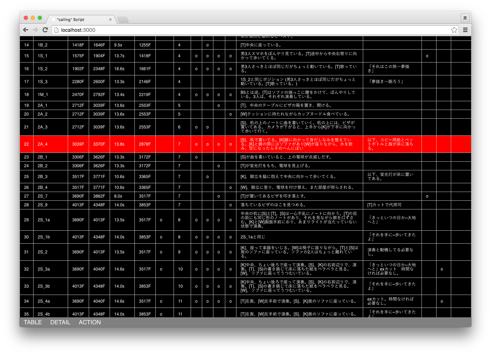
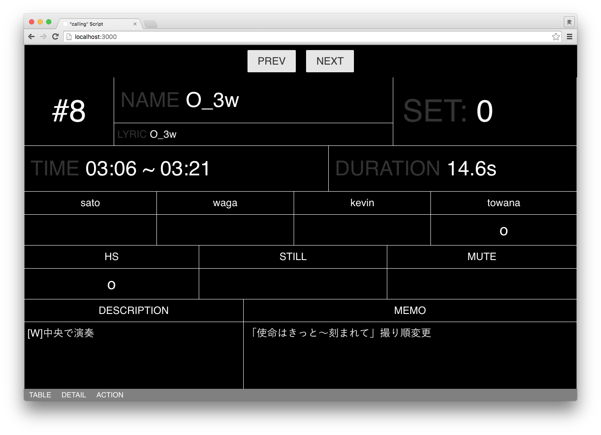
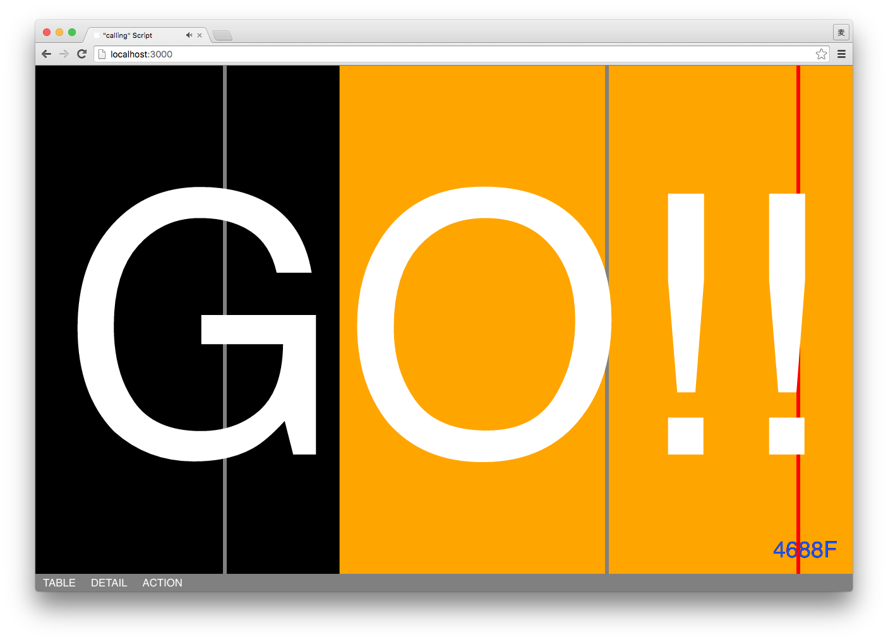

# Dolly Assist

A tool for assisting a photographer to move the accurate position of dolly along with a music. This is originally made for shooting the video '[fhana / calling](https://www.youtube.com/watch?v=VfVZDfCTTwE)'.





## Build

Using gulp, Webpack, Babel, Jade Stylus, Vue.js and so on.

```
npm install
gulp
```

## License

All source code is licensed under the terms of the MIT License. (Other assets relating to the track and lyrics are not included.)

The MIT License (MIT)

Copyright (c) 2015 Baku Hashimoto

Permission is hereby granted, free of charge, to any person obtaining a copy of this software and associated documentation files (the "Software"), to deal in the Software without restriction, including without limitation the rights to use, copy, modify, merge, publish, distribute, sublicense, and/or sell copies of the Software, and to permit persons to whom the Software is furnished to do so, subject to the following conditions:

The above copyright notice and this permission notice shall be included in all copies or substantial portions of the Software.

THE SOFTWARE IS PROVIDED "AS IS", WITHOUT WARRANTY OF ANY KIND, EXPRESS OR IMPLIED, INCLUDING BUT NOT LIMITED TO THE WARRANTIES OF MERCHANTABILITY, FITNESS FOR A PARTICULAR PURPOSE AND NONINFRINGEMENT. IN NO EVENT SHALL THE AUTHORS OR COPYRIGHT HOLDERS BE LIABLE FOR ANY CLAIM, DAMAGES OR OTHER LIABILITY, WHETHER IN AN ACTION OF CONTRACT, TORT OR OTHERWISE, ARISING FROM, OUT OF OR IN CONNECTION WITH THE SOFTWARE OR THE USE OR OTHER DEALINGS IN THE SOFTWARE.